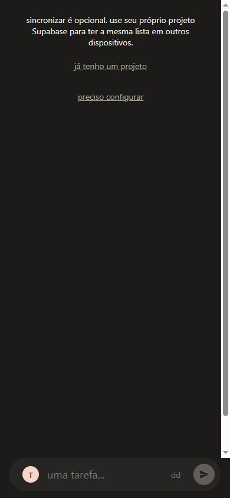
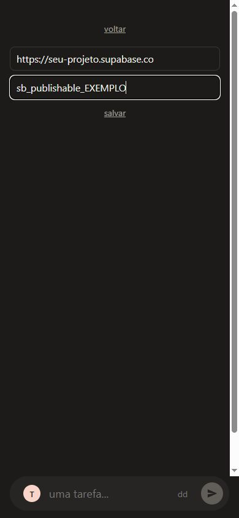

# Sincronizar o Slip entre celular e computador

O Slip funciona sem cadastro e sem configurar nada. [Abra o app](https://laginho.github.io/Slip/), escreva uma tarefa e comece a usar. Este guia é opcional: serve para levar a mesma lista a outros dispositivos.

Para sincronizar, você vai criar um banco no Supabase, um serviço que guarda as tarefas na internet. Você precisa de uma conta nesse serviço, mas não precisa instalar ferramentas de programação. Faça a configuração inicial no computador, onde é mais fácil alternar entre as páginas.

## Antes de começar

- Use um projeto Supabase exclusivo para a sua lista pessoal. Cada pessoa deve criar o próprio projeto.
- O Slip não tem login nem separação de usuários dentro de um projeto. **Quem tiver a URL e a chave poderá ler e alterar as tarefas desse projeto.** Não compartilhe esses valores em capturas de tela, mensagens públicas ou pedidos de suporte.
- As tarefas também ficam no navegador. Não limpe os dados do site nem use navegação anônima para guardar sua única cópia. Sincronização não substitui um backup.
- Consulte as condições do plano escolhido no Supabase antes de criar o projeto. Disponibilidade, limites e preços são definidos pelo serviço.

## 1. Criar o projeto

1. Abra o [painel do Supabase](https://supabase.com/dashboard) e crie sua conta ou entre nela.
2. Clique em **New project** (novo projeto). Se o serviço pedir uma organização, crie uma pessoal ou escolha a sua.
3. Dê um nome reconhecível, como `minhas-tarefas-slip`.
4. Defina a senha do banco e guarde-a em um gerenciador de senhas. **Essa senha não é a chave que será colada no Slip.**
5. Escolha a região e o plano adequados, confirme a criação e aguarde o projeto ficar disponível.

Você deve chegar ao painel do projeto. Mantenha essa aba aberta.

O Slip usa a **Data API** do Supabase para acessar as tarefas. Se você desativou essa opção ao criar o projeto, habilite-a em **Integrations → Data API** e permita o acesso à tabela `public.tasks` depois do próximo passo.

## 2. Preparar o banco

O arquivo abaixo contém as instruções que criam a tabela de tarefas. Você só precisa copiar e executar; não precisa editar o código.

1. Abra o [arquivo de preparação do Slip](../supabase/schema.sql) em outra aba.
2. No GitHub, use o botão de copiar o conteúdo do arquivo, ou abra **Raw** e copie todo o texto. Copie o arquivo inteiro, inclusive o final.
3. Volte ao seu projeto Supabase e abra **SQL Editor** no menu lateral.
4. Crie uma consulta nova (**New query**), cole o conteúdo e clique em **Run**.
5. Aguarde uma confirmação de sucesso, sem erros. O script não precisa devolver linhas de resultado.

Para conferir, abra **Table Editor**: deve existir uma tabela chamada `tasks` no esquema `public`. Se ocorrer um erro, pare aqui e consulte a seção de problemas abaixo.

Execute apenas o arquivo do Slip no projeto dedicado que você acabou de criar. O script também configura as permissões de acesso usadas pelo app.

## 3. Copiar o endereço e a chave

No painel do projeto, abra **Connect**. Localize o endereço **Project URL** e a chave **Publishable key**. Se o painel mostrar exemplos de código, copie somente os valores, sem aspas e sem o nome da variável.

| Informação | Como reconhecer | Onde será usada |
| --- | --- | --- |
| Project URL | Endereço parecido com `https://seu-projeto.supabase.co` | Campo de URL do Slip |
| Publishable key | Texto que começa com `sb_publishable_` | Campo de chave do Slip |

As chaves também ficam em **Settings → API Keys**. Se você já tem um projeto antigo, a chave legada **anon** é aceita pelo Slip. Não use **secret**, **service_role**, uma chave que comece com `sb_secret_`, a senha do banco ou uma string de conexão PostgreSQL.

Os nomes do painel podem mudar. A [documentação oficial de chaves do Supabase](https://supabase.com/docs/guides/getting-started/api-keys) mostra onde encontrá-las.

## 4. Configurar o Slip

1. Volte ao [Slip](https://laginho.github.io/Slip/).
2. Clique em **sincronizar**, próximo ao arquivo de tarefas concluídas.
3. Escolha **já tenho um projeto**. A opção **preciso configurar** abre este tutorial em outra aba.
4. Cole o **Project URL** no campo de URL do Supabase.
5. Cole a **Publishable key** no campo de chave.
6. Clique em **salvar**. Se aparecer uma mensagem de erro, corrija o valor indicado.

Salvar guarda a configuração neste navegador; não confirma que o banco está acessível. O teste do próximo passo confirma a sincronização de ponta a ponta.

Os valores da imagem são exemplos e não funcionam. Use os valores do seu projeto.

## 5. Configurar o segundo dispositivo e testar

1. Abra o Slip no outro dispositivo, usando o mesmo endereço do app.
2. Em **sincronizar → já tenho um projeto**, informe a **mesma URL e a mesma chave** do primeiro dispositivo e salve. Não crie outro projeto nem execute o SQL novamente.
3. No primeiro dispositivo, crie uma tarefa chamada `teste de sincronização`. Com internet, aguarde alguns segundos.
4. No segundo dispositivo, saia da aba do Slip e volte a ela para atualizar a lista. A tarefa deve aparecer.
5. Conclua essa tarefa no segundo dispositivo. Aguarde alguns segundos e volte à aba do Slip no primeiro: ela deve sair da lista de tarefas abertas.

Se já houver tarefas nos dois dispositivos, a sincronização reúne as listas. Tarefas criadas separadamente com o mesmo texto continuam sendo tarefas distintas.

Repita a configuração em cada navegador ou dispositivo que usar. Sem internet, você pode continuar trabalhando; as mudanças serão sincronizadas quando houver uma nova tentativa com conexão, por exemplo ao voltar ao app.

## Se algo não funcionar

| O que aconteceu | O que conferir |
| --- | --- |
| “url inválida” ou “a url precisa usar https” | Copie o Project URL inteiro, começando com `https://`. Não use o endereço do painel nem a string de conexão do banco. |
| “chave vazia” | Preencha também o campo de chave; URL e chave precisam estar juntas. |
| “chave privilegiada” | Você copiou uma chave administrativa. Volte a API Keys e use publishable ou anon. |
| “não foi possível salvar” | O navegador não conseguiu gravar a configuração. Confira se permite armazenamento de dados do site e tente fora da navegação anônima. Não limpe os dados se houver tarefas sem outra cópia. |
| O SQL deu erro | Confira se selecionou o projeto certo e copiou o arquivo inteiro para uma consulta vazia. Não prossiga enquanto a execução não terminar com sucesso. |
| Salvou, mas a tarefa não aparece no outro aparelho | Confira internet nos dois aparelhos, projeto ativo no Supabase, tabela `tasks` criada e a mesma URL/chave nos dois. Crie uma tarefa de teste, aguarde e saia e volte à aba no outro aparelho. O app não mostra erros de conexão com o banco. |
| O projeto está pausado ou indisponível | Abra o painel Supabase e siga as instruções do serviço para restabelecê-lo. Preserve os dados locais enquanto isso. |
| Apareceram tarefas de outra pessoa | Os aparelhos estão usando o mesmo projeto. Cada pessoa precisa de um projeto próprio; não continue editando essa lista compartilhada. |

Para pedir ajuda, informe o passo e a mensagem de erro. Oculte URL, chaves, senhas e conteúdo pessoal antes de enviar uma captura.

## Desligar a sincronização

Na versão pública do Slip, abra os campos de sincronização, deixe **os dois vazios** e clique em **salvar**. Isso remove a configuração desse navegador, mas não apaga as tarefas locais nem as do Supabase. Repita nos demais dispositivos se necessário.

Se você hospeda uma versão própria com configuração incluída no build, apagar os campos faz o app voltar à configuração desse build. Veja o [README](../README.md) para os detalhes de hospedagem.

## Atualizar um projeto existente

Quando uma atualização do Slip pedir atualização do banco, execute novamente o [arquivo completo de preparação](../supabase/schema.sql), como no passo 2. O script foi feito para ser executado novamente sem apagar as tarefas existentes.

Referências: [chaves e painel Connect](https://supabase.com/docs/guides/getting-started/api-keys) e [execução de SQL no painel](https://supabase.com/docs/guides/getting-started/quickstarts/nextjs). Instruções conferidas em setembro de 2026.
